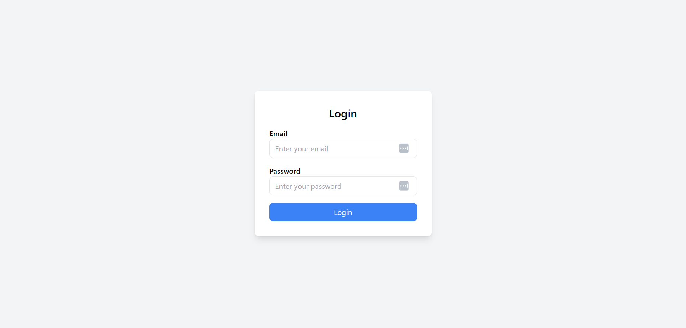
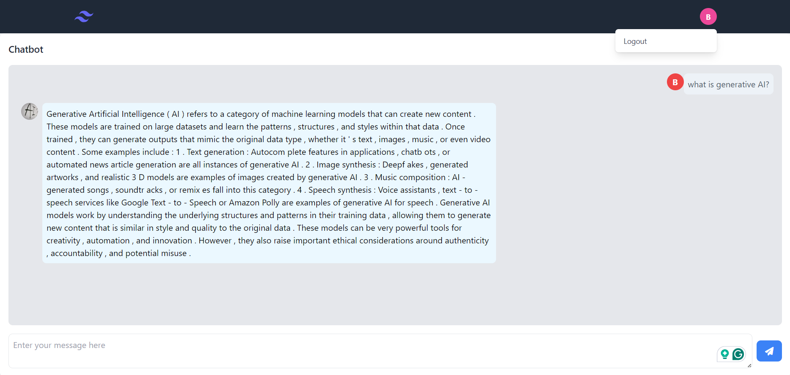

Sure, here's a README text template for your project:

---

# Chatbot Interface

## Overview

The Chatbot Interface is a web application that allows users to interact with a chatbot powered by artificial intelligence. Users can converse with the chatbot, which responds with generated text based on the input.

## Features

- **User Authentication**: Users must log in to access the chatbot interface. Authentication is handled using Django sessions and JWT tokens.
- **Chatbot Interaction**: Users can input messages into the chat interface, and the chatbot generates responses based on the input using machine learning models(mistral_api).
- **Real-time Messaging**: Messages are displayed in real-time, providing a seamless conversational experience.
- **Persistent Storage**: Messages are stored locally using browser localStorage, allowing users to access previous chat history even after refreshing the page.
- **Responsive Design**: The interface is designed to be responsive, ensuring optimal viewing and interaction across various devices and screen sizes.

## Screenshots

### Login Page


### Chatbot Interface


## Technologies Used

- **Django**: Backend framework for handling user authentication and serving web pages.
- **JavaScript**: Frontend scripting language for interactive features such as real-time messaging and local storage.
- **JWT (JSON Web Tokens)**: Used for user authentication and token-based session management.
- **Tailwind CSS**: Utility-first CSS framework for styling the user interface.
- **Docker**: Containerization tool for packaging the application and its dependencies.

## Setup Instructions

1. Clone the repository:
   ```
   git clone https://github.com/OussamaBentaouil70/chatbot_mistral.git
   ```
2. Install dependencies:
   ```
   pip install -r requirements.txt
   ```
3. Run migrations:
   ```
   python manage.py migrate
   ```
4. Start the development server:
   ```
   python manage.py runserver
   ```
5. Access the application at `http://localhost:8000`.

## Contributing

Contributions are welcome! If you have any suggestions, bug reports, or feature requests, please open an issue or submit a pull request.

## License

This project is licensed under the [MIT License](LICENSE).

---

